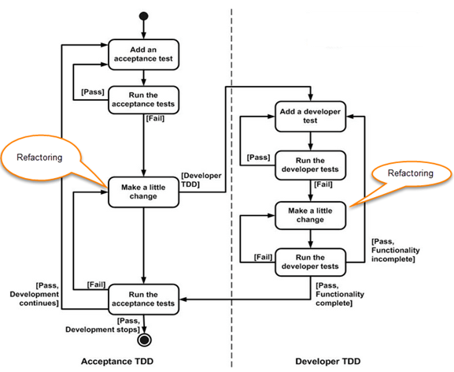

# Introduction au TDD

Bienvenu au Dojo : tels de grands sportifs, l'entrainement est indispensable pour améliorer la maîtrise de
son art et ainsi accéder à la sagesse ultime !

Dans notre cas une seule arme : le TDD. Voici l'algorithme à suivre :

Pour se mettre en jambe, rien de tel qu'un petit bowling et ensuite un peu de lecture de Harry Potter !